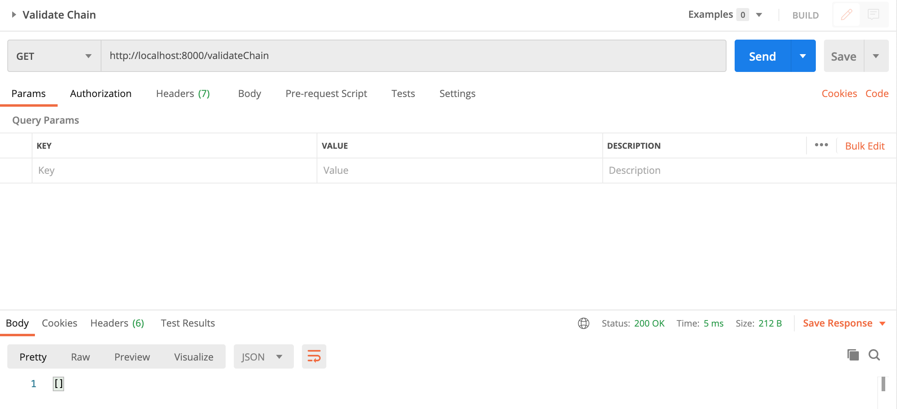

# Private Blockchain Application

Run the application with the following command from the root directory:

```
node app.js
```

Be sure you run `npm install` before trying to run the application.

## Notes

1. The route `submitstar` was renamed to `submitStar` for consistency.

2. The existing routes for getting a block by height/hash were functionally identical (`GET /block/:height` vs `GET /block/:hash`). This resulted in the first defined route overriding the second, meaning that the code for `GET /block/:hash` was never reached.

   To resolve this, I renamed the route to get blocks by hash to be `/block/hash/:hash`.
   
## Images

1. Get Genesis block: 

2. Get block by hash (notice the modified route): 

3. Request validation: 

4. Sign message: 

5. Submit star: 

6. Get stars by wallet address: 

7. Validate chain (returns an empty array if there are no errors): 